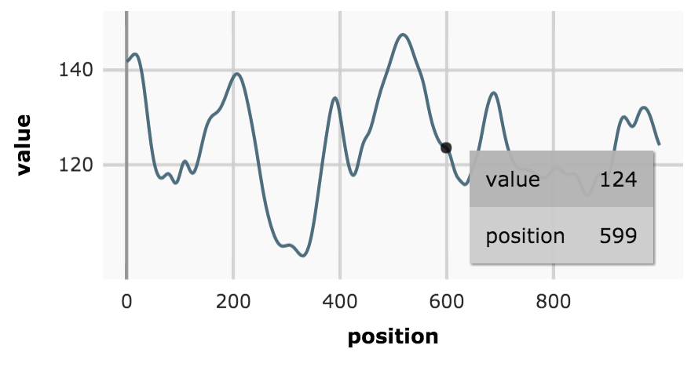

(This library is currently under development)

[](https://travis-ci.org/kensho/orama)

React data visualization components.  
**Functional API's for going from quick data exploration to complex custom visualizations.**

- Orama js handles the type extraction, domains calculation across multiple layers, managing interaction and tooltips, etc. so that you can focus on how you want your data to look.
- Aesthetics are fast to be configured trough simple theme objects.
- Smart extension points allow the creation of custom marks and interaction wrapper components (brushes, zooms, annotation, etc). Orama does the heavy lifting, so extensions can focus on functionality.

```
npm i orama --save
```



```jsx
import {Chart, Lines} from 'orama'

const MyChart = (props) => (
  <Chart>
    <Lines
      data={props.data}
      x='position'
      y='value'
    />
  </Chart>
)
```
If you don't want to do a npm/webpack/babel setup yet, or if you don't care about React, see the [Quick setup](docs/quickSetup.md)

### Docs

- [Getting started](/docs/gettingStarted.md)
- [Quick setup](/docs/quickSetup.md)
- [API](/docs/api.md)
- [Contributing](/docs/contributing.md)

*(/horáō, "to see, spiritual and mentally" – a vision, focusing on the impact it has on the one beholding the vision)*
